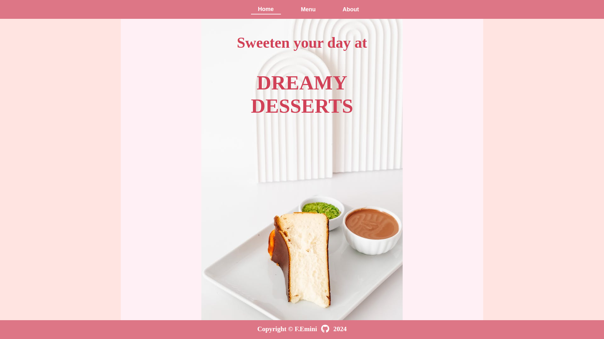
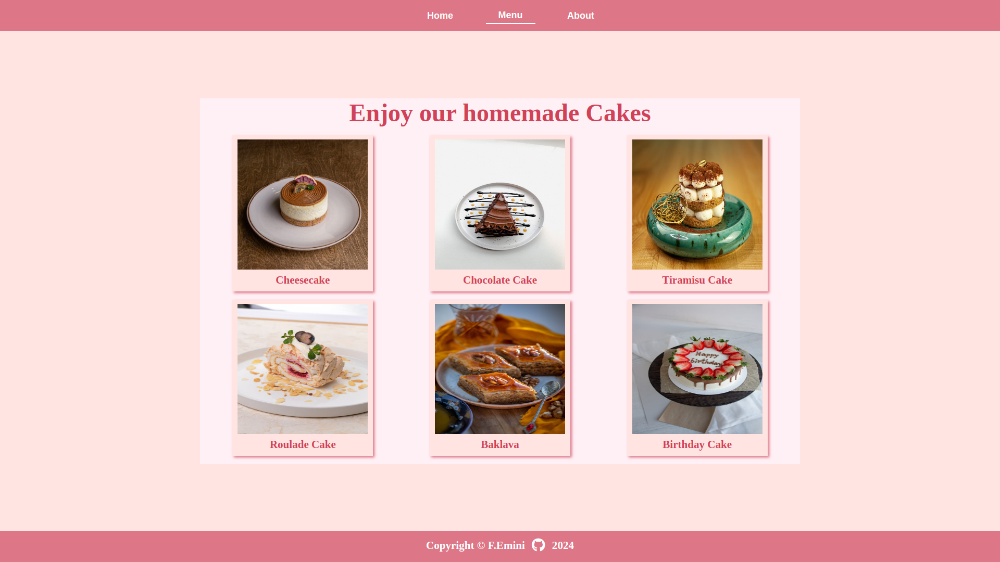
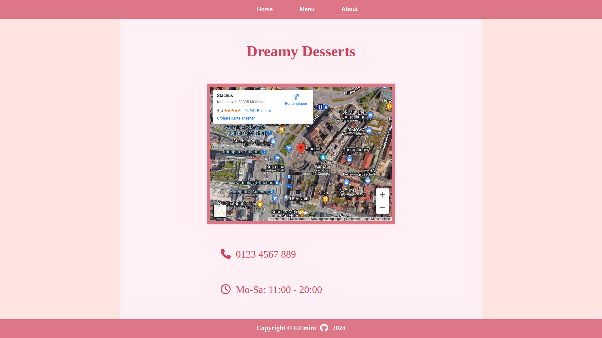

# Restaurant Page

This project is a simple website for a bakery that sells various types of cakes. It is built using JavaScript, HTML, and CSS, with the main focus being on utilizing the webpack tool for bundling the JavaScript and CSS files.
This project is part of The Odin Project's curriculum.

## Preview

## Features

- **Webpack Integration:** The project leverages webpack for bundling JavaScript and CSS files, allowing for efficient management of dependencies and assets.
- **Responsive Design:** The website is designed to be responsive, ensuring optimal viewing experience across different devices and screen sizes.
- **Modular Structure:** The website is structured into separate modules for home, menu, and about sections, making it easier to organize and maintain the codebase.
- **Tab-Switching Logic:** The website includes tab-switching logic, allowing users to navigate between different sections of the website seamlessly.

## Project Structure

The project consists of the following files:

- **index.js:** Entry point of the application where webpack is configured to bundle the JavaScript files. It also contains logic for setting up event listeners for tab-switching and initializing the website.
- **home.js:** Module responsible for creating and loading the home section of the website.
- **menu.js:** Module responsible for creating and loading the menu section of the website, including dynamic creation of cake items.
- **about.js:** Module responsible for creating and loading the about section of the website, including embedding a Google Maps iframe.

## Live Preview

You can view a live preview of the website [here](#) (https://fatbardheminii.github.io/restaurant-page-TOP/).

## Getting Started

To run the project locally, follow these steps:

1. Clone the repository to your local machine.
2. Install the necessary dependencies using npm or yarn.
3. Run the development server using the provided npm scripts.
4. Open the website in your preferred web browser and start exploring!

## Technologies Used

- JavaScript (ES6+)
- HTML5
- CSS3
- Webpack

## Contributions

- Contributions to this project are welcome! Feel free to submit pull requests or raise issues for any improvements or fixes.

